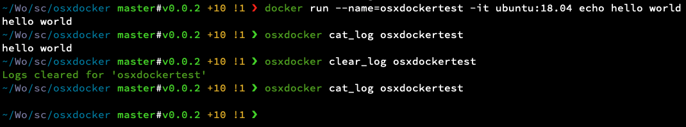
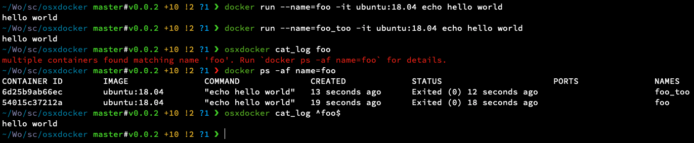

[](https://github.com/ConorSheehan1/osxdocker/actions/)
[](https://pypi.org/project/osxdocker/)
[](https://opensource.org/licenses/MIT)
[](https://github.com/psf/black)
[](https://github.com/ConorSheehan1/osxdocker/blob/master/Pipfile)

# osxdocker
A CLI for working with docker on OSX 

Currently it only handles docker logs, because I found it annoying starting up a screen session to get to the docker vm every time I wanted to clear logs.
See: https://stackoverflow.com/questions/42527291/clear-logs-in-native-docker-on-mac

## Install
```bash
# python3 only
pip3 install osxdocker
```

## Usage
```bash
# clear logs
osxdocker clear_log $some_container_name

# list available commands and flags
osxdocker
```



This cli uses https://github.com/google/python-fire  
Check out the docs for more details on usage, setting up bash completion, etc.  
Also worth noting:
1. Because the package uses fire, it can be imported like a normal python package. e.g.
    ```python
    from osxdocker.docker_logs import DockerLogs
    DockerLogs().log_path('foo')
    ```
2. This cli doesn't support `--version` due to a quirk with fire.
    ```bash
    osxdocker version # works fine
    osxdocker --version # won't work
    ```

#### Edge cases and gotchas
Container names are unique, but containers are filtered by regex, so you can still run into issues.  
e.g. You have two containers, named foo and foo_too.  
`osxdocker cat_log foo` will fail because it matches foo and foo_too.  
`osxdocker cat_log ^foo$` will work because it matches foo exactly.



## Developer details
### Dev Install
```bash
# install dev dependencies
pipenv install --dev

# install osxdocker as symlink to avoid reinstall whenever code changes
pipenv run dev_install

# only runs from pipenv in dev
pipenv run osxdocker 
```

### Test pypi install
```bash
# install from test pypi, allow pull from non-test pypi for fire
pip3 install --index-url https://test.pypi.org/simple/ --extra-index-url https://pypi.org/simple osxdocker
```

### Dev tools
#### Deploy
https://github.com/takluyver/flit/ manages building and deploying

```bash
# build dist
pipenv run flit build

# publish to test pypi
pipenv run publish_test

# really publish
pipenv run publish
```

#### Tests
```bash
pipenv run tests
```

#### Linter
```bash
# to autoformat python code
pipenv run lint

# to sort imports
pipenv run isort -y
```