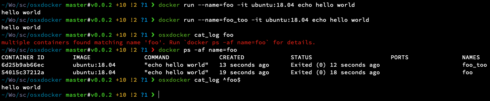

[](https://github.com/ConorSheehan1/osxdocker/actions/)
[](https://osxdocker.readthedocs.io)
[](https://pypi.org/project/osxdocker/)
[](https://opensource.org/licenses/MIT)
[](https://github.com/psf/black)

# osxdocker
A CLI for working with docker on OSX

Currently it just handles docker logs, because I found it annoying starting up a screen session to get to the docker vm every time I wanted to clear logs. 
See: https://stackoverflow.com/questions/42527291/clear-logs-in-native-docker-on-mac

## Install
```bash
# installs osxdocker and recommended docker and screen dependencies
brew install conorsheehan1/conorsheehan1/osxdocker

# installs osxdocker cli only, assumes you have docker and screen on your path
pip3 install osxdocker
```

## Usage
```bash
# clear logs
osxdocker clear_logs $some_container_name

# list available commands and flags
osxdocker
```


This cli uses https://github.com/google/python-fire  
Check out the docs for more details on usage, setting up bash completion, etc.  
Also worth noting:
1. Because the package uses fire, it can be imported like a normal python package. e.g.
    ```python
    from osxdocker.docker_logs import DockerLogs
    DockerLogs().logs_path('foo')
    ```
2. This cli doesn't support `--version` due to a quirk with fire.
    ```bash
    osxdocker version # works fine
    osxdocker --version # won't work
    ```

#### Edge cases and gotchas
Container names are unique, but containers are filtered by regex, so you can still run into issues.  
e.g. You have two containers, named foo and foo_too.  
`osxdocker cat_logs foo` will fail because it matches foo and foo_too.  
`osxdocker cat_logs ^foo$` will work because it matches foo exactly.



#### Developer notes
See [docs/source/dev.md](docs/source/dev.md)
